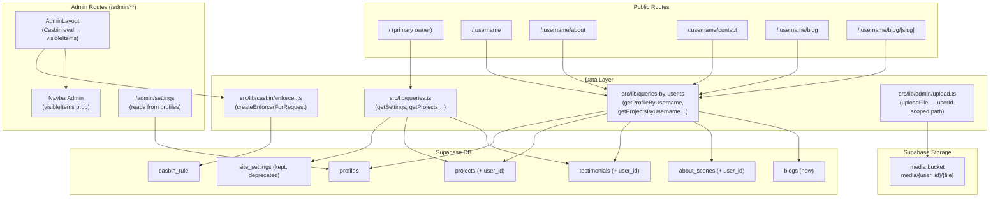

# Design Document — Multi-Tenant Portfolio

## Overview

This document describes the technical design for transforming the existing single-tenant portfolio into a multi-tenant platform. Each registered user gets a fully isolated public portfolio at `/:username`. The design preserves complete backward compatibility: the existing owner's content, the root `/` route, and the admin panel all continue to work during and after the migration.

The key changes are:

1. **Database**: New `profiles` table replacing `site_settings` as the tenant identity store; `user_id` columns added to all content tables; a new `blogs` table; a `casbin_rule` table for RBAC policies; an auth trigger for automatic profile creation on signup.
2. **Data layer**: New `src/lib/queries-by-user.ts` file with username-scoped query functions; new domain types `Profile` and `BlogPost`.
3. **Routing**: New `src/app/[username]/` route group for public portfolio pages, placed so it does not conflict with existing top-level routes.
4. **RBAC**: Server-side Casbin.js enforcer loaded from the `casbin_rule` table; admin layout evaluates policies per-request and passes `visibleItems` to `NavbarAdmin`.
5. **Storage**: Upload paths scoped to `{user_id}/{filename}` within the `media` bucket; RLS policies restrict writes to the owning user's prefix.
6. **Admin**: `NavbarAdmin` accepts a `visibleItems` prop; `getSettingsForAdmin` reads from `profiles` once the table exists.

---

## Architecture



### Key Design Decisions

**Route placement — `(portfolio)` route group**: The `[username]` dynamic segment must not shadow `/admin`, `/api`, `/about`, `/contact`, or `/blog`. The solution is a Next.js route group: `src/app/(portfolio)/[username]/`. Route groups (parenthesised folders) are invisible to the URL and have no effect on routing precedence — Next.js resolves static segments before dynamic ones, so `/admin` always wins over `/[username]`. No middleware magic is needed.

**Per-request Casbin enforcer**: Casbin's `newEnforcer()` is called fresh inside the admin layout Server Component on every request. No module-level singleton. This prevents cross-request state leakage in Next.js serverless/edge environments where module scope can be shared across concurrent requests.

**`queries-by-user.ts` isolation**: Username-scoped queries live in a separate file from `queries.ts` to avoid widening the public API surface. The existing `queries.ts` is unchanged and continues to serve the root `/` page and any fallback paths.

**`profiles` replaces `site_settings` in admin**: `getSettingsForAdmin` switches to reading `profiles` once the table exists. The `site_settings` table remains in place as a fallback and for rollback safety.

---

## Components and Interfaces

### New Files

| File | Purpose |
|------|---------|
| `src/lib/queries-by-user.ts` | Username-scoped public read queries + `Profile`/`BlogPost` row mappers |
| `src/lib/casbin/enforcer.ts` | `createEnforcerForRequest()` — fresh Casbin enforcer per request |
| `src/lib/casbin/model.conf` | Casbin RBAC model definition |
| `src/app/(portfolio)/[username]/page.tsx` | Tenant home page |
| `src/app/(portfolio)/[username]/about/page.tsx` | Tenant about page |
| `src/app/(portfolio)/[username]/contact/page.tsx` | Tenant contact page |
| `src/app/(portfolio)/[username]/blog/page.tsx` | Tenant blog index |
| `src/app/(portfolio)/[username]/blog/[slug]/page.tsx` | Tenant blog post |
| `supabase/migrations/0005_multi_tenant.sql` | All schema changes for this feature |

### Modified Files

| File | Change |
|------|--------|
| `src/components/Layouts/AdminNavbar/index.tsx` | Add `visibleItems: NavItemKey[]` prop; filter ITEMS |
| `src/app/admin/layout.tsx` | Evaluate Casbin policies; pass `visibleItems` to NavbarAdmin |
| `src/lib/admin/queries.ts` | `getSettingsForAdmin` reads from `profiles` table |
| `src/lib/admin/upload.ts` | Path constructed as `${userId}/${uuid}.${ext}` |
| `src/lib/types.ts` | Add `Profile` and `BlogPost` domain types |

### `NavbarAdmin` Component Interface

```typescript
// src/components/Layouts/AdminNavbar/index.tsx

export type NavItemKey =
  | "dashboard"
  | "about"
  | "projects"
  | "blog"
  | "tools"
  | "testimonials"
  | "settings";

interface NavbarAdminProps {
  visibleItems: NavItemKey[];
}

export function NavbarAdmin({ visibleItems }: NavbarAdminProps) {
  // Filters ITEMS array to only those whose key is in visibleItems
  // Existing client-side active-state and NavGroup logic is unchanged
}
```

The `ITEMS` array gains a `key: NavItemKey` field on each entry that maps to the Casbin object name.

### `createEnforcerForRequest` Interface

```typescript
// src/lib/casbin/enforcer.ts

/**
 * Creates a fresh Casbin enforcer backed by the casbin_rule table.
 * Must be called per-request — never stored at module scope.
 * Returns null if the DB is unreachable (caller should deny all).
 */
export async function createEnforcerForRequest(): Promise<Enforcer | null>

/**
 * Resolves which NavItemKeys a user may read, given their email.
 * Falls back to ["dashboard"] on any error or empty policy set.
 */
export async function getVisibleNavItems(userEmail: string): Promise<NavItemKey[]>
```

### `queries-by-user.ts` Interface

```typescript
// src/lib/queries-by-user.ts

export interface ProfileRow { /* snake_case DB columns */ }
export interface BlogPostRow { /* snake_case DB columns */ }

export function mapProfileRow(r: ProfileRow): Profile
export function mapBlogPostRow(r: BlogPostRow): BlogPost

export const getProfileByUsername: (username: string) => Promise<Profile | null>
export const getProjectsByUsername: (username: string) => Promise<Project[]>
export const getTestimonialsByUsername: (username: string) => Promise<Testimonial[]>
export const getAboutScenesByUsername: (username: string) => Promise<AboutScene[]>
export const getBlogsByUsername: (username: string) => Promise<BlogPost[]>
export const getBlogByUsernameAndSlug: (username: string, slug: string) => Promise<BlogPost | null>
```

All functions are wrapped in `React.cache()`, never throw, and return `null` or `[]` when Supabase is not configured.

---

## Data Models

### Entity Relationship Diagram

The following diagram reflects the authoritative data model for all multi-tenant content. Every content table carries a `user_id` foreign key pointing to `profiles.id` (which equals `auth.users.id`). There is no surrogate tenant key — the Supabase Auth identity IS the tenant identity.

```
+------------------------------------+
| auth.users (Supabase Auth Core)    |
+------------------------------------+
                 | (1 : 1)
                 v
+------------------------------------+
| public.profiles                    |
| ────────────────────────────────── |
| id (PK) -> references auth.users   |
| username (UNIQUE) [e.g. "dimas"]   |
| name, role, email, avatar, etc.    |
+------------------------------------+
                 |
                 |-- (1 : N) --> public.projects      (FK: user_id)
                 |-- (1 : N) --> public.testimonials  (FK: user_id)
                 |-- (1 : N) --> public.about_scenes  (FK: user_id)
                 +-- (1 : N) --> public.blogs         (FK: user_id)
```

Key constraints:
- `profiles.id` is both PK and FK to `auth.users(id) on delete cascade` — no auto-increment surrogate.
- All content FKs use `on delete cascade` — deleting a profile purges all their content.
- `blogs` has a composite unique constraint on `(user_id, slug)` — slugs are scoped per tenant, not globally unique.
- RLS policies on all content tables: anon reads `published = true` only; authenticated users read/write only their own rows (`user_id = auth.uid()`).


### New Domain Types (`src/lib/types.ts`)

```typescript
export interface Profile {
  id: string;               // UUID = auth.users.id
  username: string;
  name: string;
  shortName: string;
  role: string;
  university: string;
  location: string;
  email: string;
  description: string;
  social: {
    github: string;
    linkedin: string;
    facebook: string;
    instagram: string;
  };
  heroBackURL: string | null;
  heroFrontURL: string | null;
  heroMobileURL: string | null;
  aboutImageURL: string | null;
  cvURL: string | null;
  createdAt: string;
  updatedAt: string;
}

export interface BlogPost {
  id: string;
  userId: string;
  slug: string;
  title: string;
  summary: string;
  content: string;       // Markdown
  coverUrl: string | null;
  published: boolean;
  publishedAt: string | null;
  createdAt: string;
  updatedAt: string;
}
```

### Migration 0005 — Database Schema

**File**: `supabase/migrations/0005_multi_tenant.sql`

The migration is structured in the following order, with `if not exists` guards throughout to ensure idempotency.

#### 1. `profiles` table

```sql
create table if not exists public.profiles (
  id               uuid primary key references auth.users(id) on delete cascade,
  username         text unique not null,
  name             text not null,
  short_name       text not null default '',
  role             text not null default '',
  university       text not null default '',
  location         text not null default '',
  email            text not null default '',
  description      text not null default '',
  social_github    text not null default '',
  social_linkedin  text not null default '',
  social_facebook  text not null default '',
  social_instagram text not null default '',
  hero_back_url    text,
  hero_front_url   text,
  hero_mobile_url  text,
  about_image_url  text,
  cv_url           text,
  created_at       timestamptz not null default now(),
  updated_at       timestamptz not null default now()
);

create unique index if not exists profiles_username_idx on public.profiles (username);
create index        if not exists profiles_id_idx       on public.profiles (id);
```

RLS policies:

```sql
alter table public.profiles enable row level security;

-- Anon: read any profile (public portfolios)
create policy "profiles_anon_select" on public.profiles
  for select using (true);

-- Auth: read own row
create policy "profiles_auth_select" on public.profiles
  for select to authenticated using (auth.uid() = id);

-- Auth: insert own row (trigger uses security definer, but also allow direct insert)
create policy "profiles_auth_insert" on public.profiles
  for insert to authenticated with check (auth.uid() = id);

-- Auth: update own row
create policy "profiles_auth_update" on public.profiles
  for update to authenticated using (auth.uid() = id) with check (auth.uid() = id);
```

#### 2. Migrate `site_settings` → `profiles` (idempotent)

```sql
-- Only runs if profiles is empty (first migration), uses DO block for error handling
do $$
begin
  if not exists (select 1 from public.profiles limit 1) then
    if not exists (select 1 from public.site_settings where id = 1) then
      raise exception 'profiles migration failed: site_settings row id=1 does not exist';
    end if;

    insert into public.profiles (
      id, username, name, short_name, role, university, location, email,
      description, social_github, social_linkedin, social_facebook,
      social_instagram, hero_back_url, hero_front_url, hero_mobile_url,
      about_image_url, cv_url
    )
    select
      (select id from auth.users order by created_at asc limit 1),
      'dimasyudhana',
      name, short_name, role, university, location, email, description,
      social_github, social_linkedin, social_facebook, social_instagram,
      hero_back_url, hero_front_url, hero_mobile_url, about_image_url, cv_url
    from public.site_settings
    where id = 1
    on conflict (id) do nothing;
  end if;
end $$;
```

#### 3. Add `user_id` to content tables + backfill

```sql
alter table public.projects     add column if not exists user_id uuid references public.profiles(id) on delete cascade;
alter table public.testimonials add column if not exists user_id uuid references public.profiles(id) on delete cascade;
alter table public.about_scenes add column if not exists user_id uuid references public.profiles(id) on delete cascade;

-- Backfill existing rows with primary owner's profile id
update public.projects
  set user_id = (select id from public.profiles order by created_at asc limit 1)
  where user_id is null;

update public.testimonials
  set user_id = (select id from public.profiles order by created_at asc limit 1)
  where user_id is null;

update public.about_scenes
  set user_id = (select id from public.profiles order by created_at asc limit 1)
  where user_id is null;
```

Updated RLS policies for `projects` (same pattern for `testimonials` and `about_scenes`):

```sql
drop policy if exists "projects_select" on public.projects;
drop policy if exists "projects_insert" on public.projects;
drop policy if exists "projects_update" on public.projects;
drop policy if exists "projects_delete" on public.projects;

create policy "projects_select" on public.projects
  for select using (
    published = true
    or user_id = (select id from public.profiles where id = auth.uid())
  );
create policy "projects_insert" on public.projects
  for insert to authenticated
  with check (user_id = (select id from public.profiles where id = auth.uid()));
create policy "projects_update" on public.projects
  for update to authenticated
  using (user_id = (select id from public.profiles where id = auth.uid()))
  with check (user_id = (select id from public.profiles where id = auth.uid()));
create policy "projects_delete" on public.projects
  for delete to authenticated
  using (user_id = (select id from public.profiles where id = auth.uid()));
```

#### 4. `blogs` table

```sql
create table if not exists public.blogs (
  id           uuid primary key default gen_random_uuid(),
  user_id      uuid not null references public.profiles(id) on delete cascade,
  slug         text not null,
  title        text not null,
  summary      text not null default '',
  content      text not null default '',
  cover_url    text,
  published    boolean not null default false,
  published_at timestamptz,
  created_at   timestamptz not null default now(),
  updated_at   timestamptz not null default now(),
  constraint blogs_user_slug_unique unique (user_id, slug)
);

create index if not exists blogs_user_published_idx on public.blogs (user_id, published, published_at desc);
create index if not exists blogs_slug_idx            on public.blogs (slug);
```

RLS mirrors the content table pattern above.

#### 5. Auth trigger for automatic profile creation

```sql
create or replace function public.handle_new_user()
returns trigger
language plpgsql
security definer
set search_path = public
as $$
declare
  v_username text;
  v_name     text;
  v_base     text;
  v_suffix   int;
  v_candidate text;
begin
  v_username := nullif(trim(new.raw_user_meta_data->>'username'), '');
  v_name     := coalesce(nullif(trim(new.raw_user_meta_data->>'name'), ''), split_part(new.email, '@', 1));

  if v_username is null then
    v_username := split_part(new.email, '@', 1);
  end if;

  -- Uniqueness collision handling: append 4-digit suffix
  v_base      := v_username;
  v_candidate := v_base;
  v_suffix    := 1000;
  while exists (select 1 from public.profiles where username = v_candidate) loop
    v_candidate := v_base || '_' || v_suffix::text;
    v_suffix    := v_suffix + 1;
  end loop;

  insert into public.profiles (id, username, name)
  values (new.id, v_candidate, v_name)
  on conflict (id) do nothing;

  return new;
end;
$$;

drop trigger if exists on_auth_user_created on auth.users;
create trigger on_auth_user_created
  after insert on auth.users
  for each row execute function public.handle_new_user();
```

#### 6. `casbin_rule` table + seed

```sql
create table if not exists public.casbin_rule (
  id    serial primary key,
  ptype text,
  v0    text, v1 text, v2 text,
  v3    text, v4 text, v5 text
);

-- Seed initial RBAC policies (idempotent)
insert into public.casbin_rule (ptype, v0, v1, v2) values
  ('p', 'admin',  'dashboard', 'read'),
  ('p', 'admin',  'projects',  'read'),
  ('p', 'admin',  'blog',      'read'),
  ('p', 'admin',  'settings',  'read'),
  ('p', 'editor', 'dashboard', 'read'),
  ('p', 'editor', 'projects',  'read'),
  ('p', 'editor', 'blog',      'read')
on conflict do nothing;

-- Role assignments (g = user, role)
insert into public.casbin_rule (ptype, v0, v1) values
  ('g', 'dimas',   'admin'),
  ('g', 'yudhana', 'editor')
on conflict do nothing;
```

#### 7. Storage RLS — per-user path isolation

```sql
drop policy if exists "media_auth_insert" on storage.objects;
drop policy if exists "media_auth_update" on storage.objects;
drop policy if exists "media_auth_delete" on storage.objects;

-- Users may only write to their own prefix
create policy "media_auth_insert" on storage.objects
  for insert to authenticated
  with check (
    bucket_id = 'media'
    and (storage.foldername(name))[1] = auth.uid()::text
  );
create policy "media_auth_update" on storage.objects
  for update to authenticated
  using (
    bucket_id = 'media'
    and (storage.foldername(name))[1] = auth.uid()::text
  );
create policy "media_auth_delete" on storage.objects
  for delete to authenticated
  using (
    bucket_id = 'media'
    and (storage.foldername(name))[1] = auth.uid()::text
  );

-- Anon public read is unchanged
-- (existing media_public_read policy is retained as-is)
```

### Casbin RBAC Model (`src/lib/casbin/model.conf`)

```ini
[request_definition]
r = sub, obj, act

[policy_definition]
p = sub, obj, act

[role_definition]
g = _, _

[policy_effect]
e = some(where (p.eft == allow))

[matchers]
m = g(r.sub, p.sub) && r.obj == p.obj && r.act == p.act
```

### Route Structure

```
src/app/
├── (portfolio)/            ← Route group: invisible to URL, no conflict
│   └── [username]/
│       ├── page.tsx        → /:username  (hero/home)
│       ├── about/
│       │   └── page.tsx    → /:username/about
│       ├── contact/
│       │   └── page.tsx    → /:username/contact
│       └── blog/
│           ├── page.tsx    → /:username/blog
│           └── [slug]/
│               └── page.tsx → /:username/blog/[slug]
├── admin/                  ← NOT shadowed (static wins over dynamic)
├── api/                    ← NOT shadowed
├── about/                  ← NOT shadowed
├── contact/                ← NOT shadowed
├── blog/                   ← NOT shadowed
└── page.tsx                ← / (primary owner, backward compat)
```

Next.js App Router resolves routes in this precedence order: exact static routes → route groups → dynamic segments. `/admin` is always matched before `/(portfolio)/[username]`.

---

## Correctness Properties

*A property is a characteristic or behavior that should hold true across all valid executions of a system — essentially, a formal statement about what the system should do. Properties serve as the bridge between human-readable specifications and machine-verifiable correctness guarantees.*

#### Property Reflection

After prework analysis, the following consolidations apply:

- Properties on row mappers (6.9, 6.10) — `mapProfileRow` and `mapBlogPostRow` — can be unified into one "mapper round-trip" property.
- Properties on query fallback behavior (6.8) are universal across all six query functions — unified into one "queries never throw" property.
- Properties on metadata isolation (10.1, 10.2, 10.3, 10.5) reduce to two: one for metadata content format, one for tenant isolation.
- Properties on Casbin deny-on-error (4.6, 11.4) unify into one "policy absence = dashboard only" property.
- RLS isolation properties for projects/testimonials/about_scenes/blogs (2.3) reduce to one unified "row-level content isolation" property.

---

### Property 1: Row mapper field preservation

*For any* `ProfileRow` object with arbitrary (but non-null) field values, `mapProfileRow(row)` shall produce a `Profile` where every camelCase field exactly equals the corresponding `snake_case` source field — no field is dropped, defaulted when a value is present, or misassigned to the wrong key.

**Validates: Requirements 6.9, 6.10**

---

### Property 2: Username-scoped query functions never throw

*For any* simulated Supabase client error (network failure, query timeout, malformed response), each of `getProfileByUsername`, `getProjectsByUsername`, `getTestimonialsByUsername`, `getAboutScenesByUsername`, `getBlogsByUsername`, and `getBlogByUsernameAndSlug` shall catch the error internally and return `null` or `[]` — never propagate an exception to the caller.

**Validates: Requirements 6.8**

---

### Property 3: Username query returns exactly the requested user's data

*For any* two distinct profiles A and B stored in the database, `getProjectsByUsername(A.username)` shall return only projects where `user_id = A.id`, and the result shall not contain any project whose `user_id = B.id`. The same isolation holds for `getTestimonialsByUsername`, `getAboutScenesByUsername`, `getBlogsByUsername`.

**Validates: Requirements 6.2, 6.3, 6.4, 6.5**

---

### Property 4: `getProfileByUsername` round-trip

*For any* `profile.username` present in the `profiles` table, `getProfileByUsername(profile.username)` shall return a `Profile` where `result.username === profile.username` and `result.id === profile.id`. For any string that is not a valid username in the table, it shall return `null`.

**Validates: Requirements 6.1**

---

### Property 5: Tenant metadata isolation

*For any* two distinct profiles A and B, `generateMetadata({ params: { username: A.username } })` shall produce a `title` that contains `A.name` and an `openGraph.url` that contains `A.username`, and shall not contain `B.name` or `B.username` anywhere in the returned metadata object.

**Validates: Requirements 10.1, 10.2, 10.3, 10.5**

---

### Property 6: Missing username produces empty metadata

*For any* username string that has no corresponding row in the `profiles` table, `generateMetadata` for `/:username` shall return a metadata object with no `title`, no `openGraph` block, and no `alternates.canonical` — equivalently, `notFound()` is called and no metadata is emitted.

**Validates: Requirements 10.4, 5.6**

---

### Property 7: Casbin policy absence defaults to dashboard-only

*For any* authenticated user email E that has no rows in `casbin_rule` (neither direct policies nor role assignments), `getVisibleNavItems(E)` shall return an array equal to `["dashboard"]` — exactly that one item, no more.

**Validates: Requirements 4.6, 11.4**

---

### Property 8: Casbin enforcer respects role inheritance

*For any* (user, role, navItem) triple where a `g` rule assigns `user → role` and a `p` rule grants `role` access to `navItem`, `enforce(user, navItem, "read")` shall return `true`. Conversely, if no such chain exists, `enforce(user, navItem, "read")` shall return `false`.

**Validates: Requirements 4.3, 7.1, 7.2, 7.3, 7.4, 7.5, 7.6, 7.7**

---

### Property 9: NavbarAdmin renders exactly the permitted items

*For any* `visibleItems` array of `NavItemKey` values, `<NavbarAdmin visibleItems={visibleItems} />` shall render navigation links for exactly the keys listed in `visibleItems` — no links for keys not in the array, and no keys in the array are missing from the rendered output.

**Validates: Requirements 7.2, 7.3, 7.4, 7.5, 7.6, 7.7**

---

### Property 10: Upload path scoped to user ID

*For any* authenticated `userId` string and any `File` object, `uploadFile(file, userId)` shall call `supabase.storage.upload()` with a path that starts with `userId + "/"` — never with a different user's ID as the prefix, and never with an empty or missing prefix.

**Validates: Requirements 8.1, 8.4**

---

### Property 11: RLS content isolation — auth user sees only own rows

*For any* content table (`projects`, `testimonials`, `about_scenes`, `blogs`) and any two distinct user IDs A and B, a Supabase client authenticated as user A performing an UPDATE or DELETE on a row owned by user B (where `user_id = B`) shall receive a policy violation error and the row shall remain unchanged.

**Validates: Requirements 2.3, 2.6, 8.2**

---

### Property 12: Migration idempotency

*For any* number of times `0005_multi_tenant.sql` is applied to a database that already has the migration applied, the total row count in `profiles`, `casbin_rule`, `projects`, `testimonials`, and `about_scenes` shall be identical after each re-application — no row is duplicated and no error is raised.

**Validates: Requirements 9.1**

---

### Property 13: Auth trigger username derivation

*For any* signup event where `raw_user_meta_data->>'username'` is absent or empty and the user's email is `local@domain`, the resulting `profiles.username` shall equal `local` (the part before `@`). Where `raw_user_meta_data->>'username'` is a non-empty string U, `profiles.username` shall start with U.

**Validates: Requirements 3.1, 3.3**

---

### Property 14: Auth trigger uniqueness collision resolution

*For any* existing `profiles.username` value U, a new signup that would produce username U shall instead produce a username that starts with U and is not equal to U (i.e., a unique variant with a numeric suffix), and the resulting username shall not conflict with any existing profile.

**Validates: Requirements 3.4**

---

## Error Handling

### Query functions

All public and username-scoped query functions follow the existing pattern: wrapped in `try/catch`, return a safe fallback (`null`, `[]`, or seed data), and never propagate database errors to components. When `isSupabaseConfigured` is false, functions return immediately without attempting any network call.

### Casbin enforcer

`createEnforcerForRequest()` wraps the `newEnforcer()` call in a `try/catch`. On any error (DB unreachable, adapter failure, model parse error), it returns `null`. `getVisibleNavItems()` handles a `null` enforcer by returning `["dashboard"]` — granting only the minimum required access.

```typescript
export async function getVisibleNavItems(userEmail: string): Promise<NavItemKey[]> {
  try {
    const enforcer = await createEnforcerForRequest();
    if (!enforcer) return ["dashboard"];

    const allItems: NavItemKey[] = ["dashboard", "about", "projects", "blog", "tools", "testimonials", "settings"];
    const visible: NavItemKey[] = [];
    for (const item of allItems) {
      const allowed = await enforcer.enforce(userEmail, item, "read");
      if (allowed) visible.push(item);
    }
    return visible.length > 0 ? visible : ["dashboard"];
  } catch {
    return ["dashboard"];
  }
}
```

### Portfolio router — 404 handling

Every `[username]` page calls `getProfileByUsername(username)` first. On `null`, it calls `notFound()` immediately and returns. Blog post pages do the same: `getProfileByUsername` then `getBlogByUsernameAndSlug`, calling `notFound()` if either is null.

### Migration errors

The `DO $$...$$` block in the data migration step uses an explicit `raise exception` if the prerequisite `site_settings` row is absent, surfacing the error immediately rather than silently inserting a NULL-valued profile.

### Upload errors

`uploadFile` already throws on storage error. With the new path scoping, if the authenticated user's `user_id` is unavailable, the upload function returns an error to the caller rather than constructing an invalid path.

---

## Testing Strategy

The project uses **Vitest 4.1 + jsdom** for unit tests and **fast-check** for property-based tests. fast-check is the standard PBT library for TypeScript/JavaScript, integrates with Vitest via `fc.assert(fc.asyncProperty(...))`, and supports 100+ iterations by default.

### Unit tests (example-based)

- Migration smoke tests: SQL schema introspection queries verifying column and index existence, run against a local Supabase instance or a test database.
- `getSettingsForAdmin` reads from `profiles` when the table exists (example with mock Supabase client).
- `getVisibleNavItems` with known Casbin policies returns the expected nav item array.
- Auth trigger integration: insert a test user via Supabase admin client, verify `profiles` row created.
- Storage RLS: anon client can read from `media` bucket.

### Property-based tests (fast-check, 100 iterations minimum)

Each property in the Correctness Properties section maps to exactly one property test. Tag format in code:

```typescript
// Feature: multi-tenant-portfolio, Property N: <property_text>
```

**Test for Property 1 — Row mapper field preservation**

```typescript
import * as fc from "fast-check";
import { mapProfileRow } from "@/lib/queries-by-user";

it("mapProfileRow preserves all fields", () => {
  fc.assert(fc.property(
    fc.record({
      id: fc.uuid(),
      username: fc.string({ minLength: 1 }),
      name: fc.string({ minLength: 1 }),
      short_name: fc.string(),
      role: fc.string(),
      email: fc.string(),
      // ... all ProfileRow fields
    }),
    (row) => {
      const profile = mapProfileRow(row);
      return (
        profile.id === row.id &&
        profile.username === row.username &&
        profile.name === row.name &&
        profile.shortName === row.short_name
        // ... all field assertions
      );
    }
  ), { numRuns: 100 });
});
```

**Test for Property 2 — Query functions never throw**

Use a mock anon Supabase client that throws on `.from()`. Verify all six query functions catch and return `[]` / `null`.

**Test for Property 3 — Username query isolation**

Generate two distinct profiles and their associated projects. Mock the anon client to return projects for the queried user only (by filtering on `user_id`). Verify no cross-contamination.

**Test for Property 4 — getProfileByUsername round-trip**

For any `ProfileRow`, mock the DB to return that row when queried for `row.username`. Verify `result.username === row.username && result.id === row.id`.

**Test for Property 5 — Tenant metadata isolation**

Generate two arbitrary `Profile` objects with distinct usernames. Call `generateMetadata` with each username (mocking `getProfileByUsername`). Verify A's metadata contains A's name and not B's name.

**Test for Property 6 — Missing username produces empty metadata**

For any string not in the mocked profiles set, verify `generateMetadata` calls `notFound()` and returns no metadata.

**Test for Property 7 — Casbin policy absence = dashboard only**

For any email not present in a mocked empty `casbin_rule` table, verify `getVisibleNavItems` returns `["dashboard"]`.

**Test for Property 8 — Casbin role inheritance**

For any arbitrary (user, role, navItem) triple, build a Casbin enforcer with an in-memory adapter seeded with the corresponding `g` and `p` rules. Verify `enforce(user, navItem, "read")` returns `true`.

**Test for Property 9 — NavbarAdmin renders exactly permitted items**

For any subset of `NavItemKey` values, render `<NavbarAdmin visibleItems={subset} />`. Verify rendered link count equals `subset.length` and each link's href matches the expected path.

**Test for Property 10 — Upload path scoped to user ID**

For any `userId` UUID and `File`, mock `supabase.storage.upload` to capture the path argument. Verify `path.startsWith(userId + "/")`.

**Test for Property 11 — RLS content isolation (integration)**

Run against a local Supabase test instance. For any two test users A and B, verify user A's Supabase client cannot update rows where `user_id = B.id`.

**Test for Property 12 — Migration idempotency**

Apply `0005_multi_tenant.sql` twice on a test DB. Verify row counts are stable and no errors are raised.

**Test for Property 13 — Auth trigger username derivation**

For any email string `local@domain`, insert a test auth user with no username metadata. Verify `profiles.username === local`.

**Test for Property 14 — Auth trigger uniqueness collision**

Insert a profile with username `U`. Insert a second auth user with username metadata `U`. Verify the second profile has a username starting with `U` and not equal to `U`.

### fast-check installation

```bash
npm install --save-dev fast-check
```

All property tests run with `npm run test` (Vitest picks up `*.test.ts` files). No watch mode — use `vitest --run` for single-pass execution.

### SEO testing

Metadata generation is tested via unit tests using Next.js's `generateMetadata` export pattern. For each portfolio page, call `generateMetadata({ params: { username } })` with a mocked `getProfileByUsername` and verify the returned object's shape.
